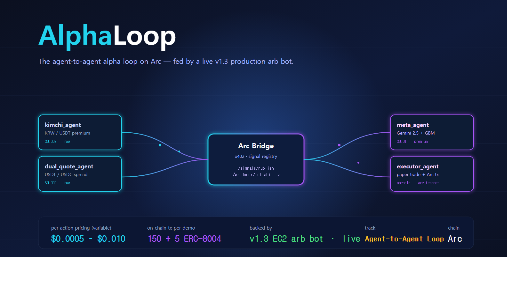

# AlphaLoop — Agent-to-Agent USDC Loop on Arc

> **lablab.ai · Agentic Economy on Arc Hackathon (Track 2: Agent-to-Agent Payment Loop)**
> Submitted 2026-04-26 KST · Solo build over 5 days



---

## TL;DR

5 ERC-8004 agents trading USDC on Arc testnet, with **variable per-action pricing** ($0.0005–$0.010) tied to signal quality. The agent stack is fed by a **live v1.3 production arbitrage bot** (Binance USDT/USDC spread, AWS EC2, 8 days of live runs / 648 trades / +$17.92 PnL backing the demo).

The closed loop:
1. **Producer agents** (kimchi premium / dual-quote spread / funding-rate basis) publish raw signals to the bridge.
2. **Meta agent** (Gemini 2.5 Flash + Q-learning over 9 regime states × 7 actions) scores them.
3. **Executor agent** pays per-signal in USDC on Arc and books a paper trade.
4. Outcome feedback re-prices future signals — a live, on-chain agent economy that closes its own books.

150 on-chain settlements + 5 ERC-8004 agent registrations on Arc testnet, all variably priced and Merkle-rooted.

---

## Submission Artifacts

| Asset | Link |
|-------|------|
| **Pitch video (4:20)** | https://youtu.be/dLcKwQLas7Q |
| **Verification video (0:50)** | https://youtu.be/EhjFr1s_JL8 |
| **GitHub (full code)** | https://github.com/Leewonwuk/signal-mesh-arc |
| **Live demo** | https://signal-mesh.vercel.app |
| **Lablab submission** | https://lablab.ai/ai-hackathons/nano-payments-arc/alphaloop/alphaloop-agent-to-agent-usdc-loop-on-arc |
| **Registry contract** | https://testnet.arcscan.app/address/0xb276b96f2da05c46b60d4b38e9beaf7d3355b7ab |
| **Merkle root** | `400039d5af1f5ea1ab6ee6068df6274d2b360f523b63b545e88e03aa06605b80` |

---

## What's in this folder

```
arc_alphaloop/
├── README.md                                    ← this file
├── 해커톤_제출플레이북_종합_260426.md           ← end-to-end hackathon playbook (11 sections, reusable)
├── postmortem_260426.md                         ← 227-team scout + 8 weakness analysis
├── docs/
│   ├── SUBMISSION.md                            ← lablab description (raw)
│   ├── AlphaLoop_Cue_Sheet.md                   ← video cue sheet (v3)
│   └── COVER_IMAGE.md                           ← cover design notes
└── assets/
    ├── AlphaLoop_Cover.png                      ← 1600×900 cover
    └── AlphaLoop_Deck.pdf                       ← 12-page pitch deck
```

The actual codebase, contracts, and tx evidence live in [`signal-mesh-arc`](https://github.com/Leewonwuk/signal-mesh-arc). This folder is the portfolio companion — design docs, pitch materials, and post-hackathon analysis.

---

## Stack

- **Chain**: Arc testnet (USDC-native settlement, sub-second finality)
- **Identity**: ERC-8004 (5 agents registered with role + sha256 anchor)
- **Wallets**: Circle Programmable Wallets (4 SCA / ERC-4337)
- **Payments**: x402 protocol, variable per-action pricing
- **AI**: Gemini 2.5 Flash (meta-allocator), custom Q-learning
- **Backing data**: live v1.3 arb bot (Binance USDT/USDC, EC2, 8d / 648 trades)
- **Frontend**: Vercel + dashboard (signal-mesh.vercel.app)
- **Tools**: Claude Code, ElevenLabs (cloned voice), Loom, ffmpeg

---

## Why this matters

On Ethereum, a $0.002 trading signal would cost ~$1.50 in gas — **mathematically impossible** at any sane scale. On Arc, the same signal settles for fractions of a cent, opening the design space for sub-cent agent-to-agent micropayments tied to actual signal quality. AlphaLoop demonstrates the smallest meaningful unit of an agent economy: **one agent paying another, in USDC, with no human in the gas tank**, using the actual production data of a live arb bot.

---

## See also

- [`postmortem_260426.md`](./postmortem_260426.md) — full competitive scout (227 submissions analyzed) + 8 self-identified weaknesses + lessons for the next hackathon
- [`해커톤_제출플레이북_종합_260426.md`](./해커톤_제출플레이북_종합_260426.md) — reusable 11-section playbook covering the entire hackathon cycle (registration → scout → build → demo → submission), with tools, templates, gotchas, code snippets

---

🏆 *Results announcement: 2026-04-27 07:00 KST (On-site Winners Ceremony, San Francisco)*
